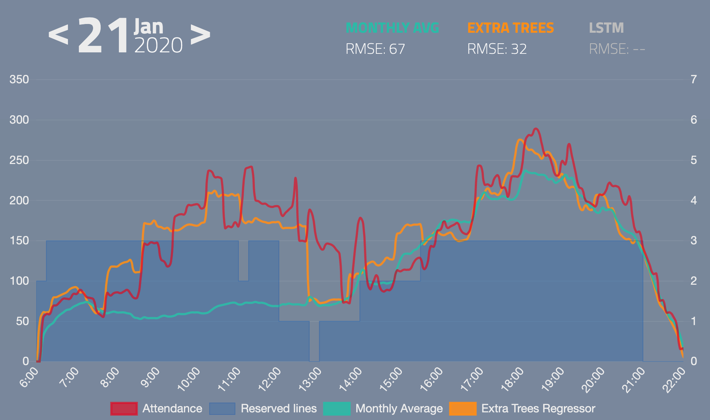

# Šutka Swimming Pool Attendance Prediction

This repository contain all code for my personal project that is predicting attendance of [Šutka](https://www.sutka.eu/en/) swimming pool.

Live web with predictions is running on [www.lukoucky.com](https://lukoucky.com/)

Project is still work in progress. So far following is done:
* Gathering of attendance data, swimming lines usage data and weather data and storing them in database
* Visualization of data on web page
* Data processing for machine learning algorithms
* Several algorithms trained for prediction. Best performance so far have [Extra Trees Regressor](https://scikit-learn.org/stable/modules/generated/sklearn.ensemble.ExtraTreesRegressor.html)

Still on TODO list:
* [ ] Finalize scipts for data exporting
* [ ] Automated generation of prediction 
* [X] ~~Host website with predictions on github.io and get predictions through REST API (needs server with HTTPS)~~
* [ ] Move from MySQL to SQLite
* [ ] Tune algorithms that are working now for better performance
* [ ] Refactor very slow `preprocessing_data.py`
* [ ] Implement Hidden Markov Model 
* [ ] Tune LSTM's 
* [ ] Make nicer web page and make it mobile friendly
* [ ] Move project to container
* [ ] Writte short blog about this project
